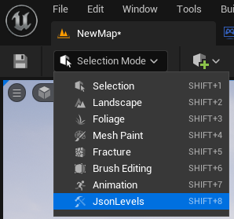
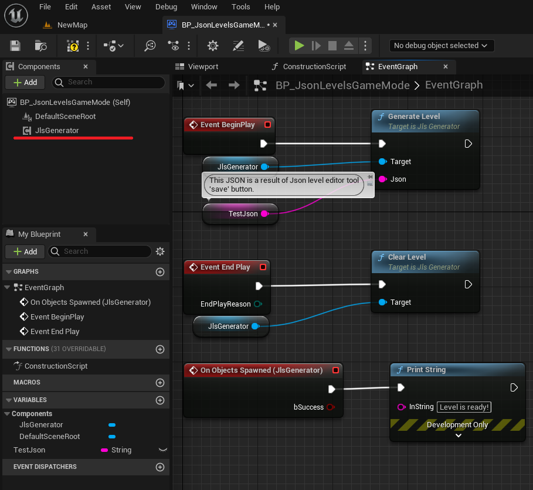
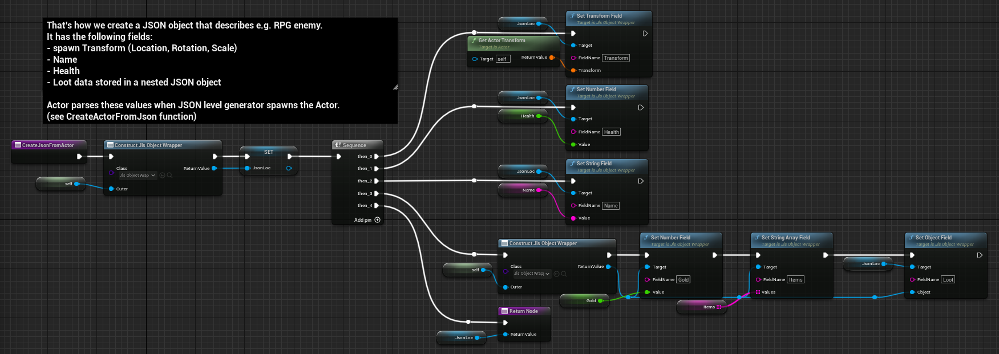
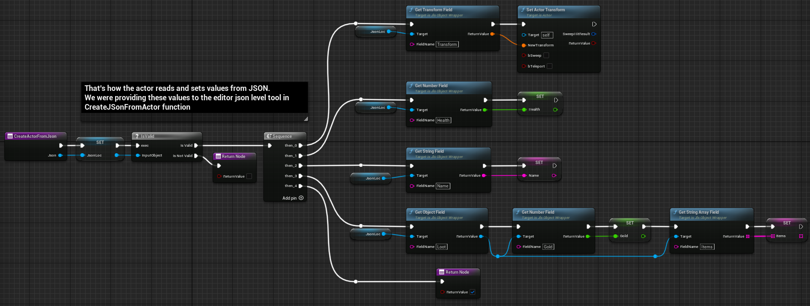
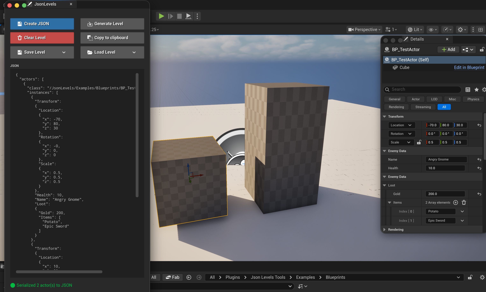
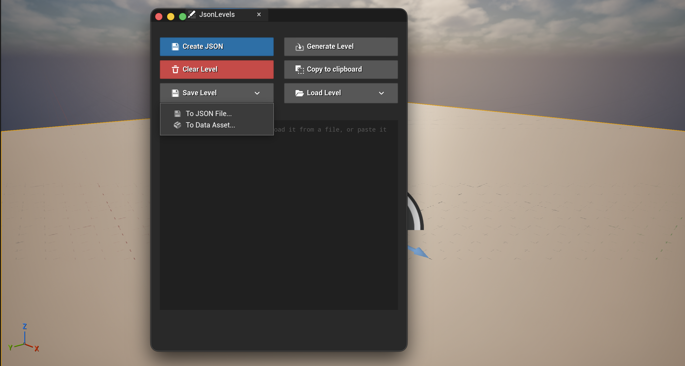
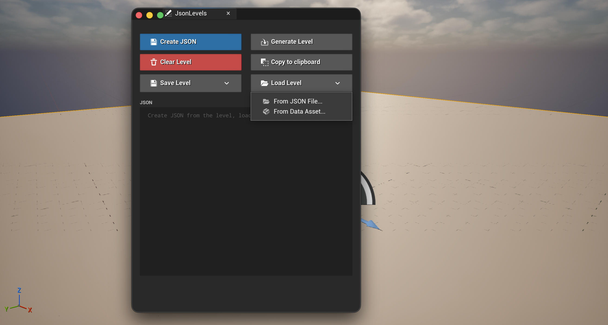
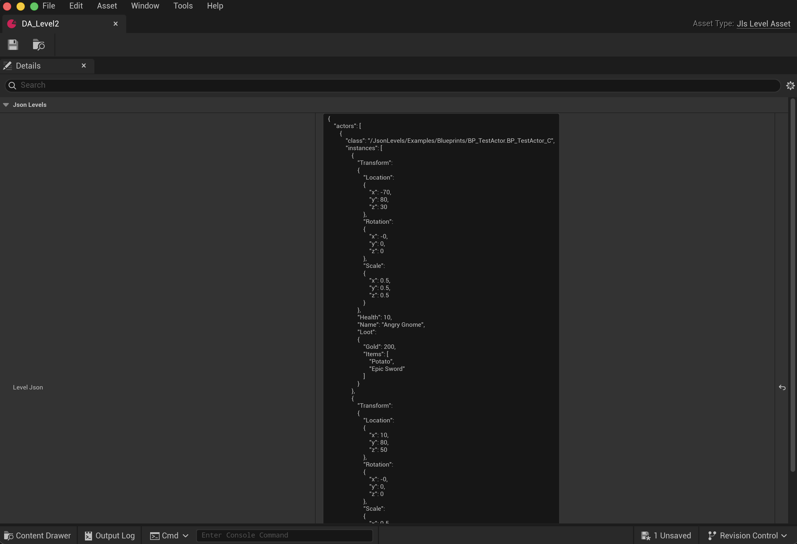

# Json Levels plugin documentation

## Table of Contents
1. [Overview](#overview)
2. [Requirements](#requirements)
3. [Installation](#installation)
4. [JSON → Level](#json--level)
   - [C++ Tutorial](#c-tutorial-a-bit-more-technical)
   - [Blueprints Tutorial](#blueprints-tutorial-a-bit-less-technical)
5. [Level → JSON](#level--json)
6. [Saving and loading levels](#saving-and-loading-levels)
7. [Examples](#examples)
8. [Support](#support)

## Overview
Json Levels is a plugin that helps you generate text-based (JSON) representations of levels via an editor tool, then construct levels from that text at runtime.

It's perfect for casual games with multiple levels (e.g. match-3, puzzles, arkanoid), but you can use it in any scenario where you need to dynamically generate actors from text data.

## Requirements
- **Supported Unreal Engine versions:** 4.27, 5.0–5.8
- **Platforms:** Windows, Mac (OSX), Linux, iOS, Android

## Installation
1. Get the plugin from [Fab](https://www.fab.com/listings/a49ebbbf-82f2-42e2-81c4-9c891c8bd698?lang=en) (or add it directly to your project's `Plugins/` folder).
2. Open your project, then go to **Edit → Plugins** and make sure **Json Levels Tools** is enabled.
3. Restart the editor if prompted.
4. Open the JsonLevels panel: in the Level Editor toolbar, click the **Select Mode** dropdown (top-left, above the viewport) and choose **JsonLevels**.

    

## JSON → Level

### C++ Tutorial (a bit more technical)
Add a `UJlsGenerator` actor component to one of your game objects (e.g. game mode or game state).
It has 2 functions:

    /** Parse Json and spawn objects listed in it. Once all objects are spawned, call OnObjectsSpawned callback.
    * @param Json String representation of a Json that contains data about actors that should be spawned. */
    UFUNCTION(BlueprintCallable, Category = "JsonLevels")
    void GenerateLevel(const FString& Json);

    /** Remove all actors that implement IJlsGameplayActor interface from the scene */
    UFUNCTION(BlueprintCallable, Category = "JsonLevels")
    void ClearLevel();

There are two more ways to generate a level, covered in [Saving and loading levels](#saving-and-loading-levels): `GenerateLevelFromFile(...)` and `GenerateLevelFromAsset(...)`.

It also exposes an `OnObjectsSpawned` delegate, which fires once all objects from the JSON have been spawned and the level is ready:

    /** Callback that is being called once all actors from Json are spawned by GenerateLevel() */
    UPROPERTY(BlueprintAssignable, Category="LevelToJson")
    FOnObjectsSpawned OnObjectsSpawned;

Actors that will be part of the JSON data should implement the `IJlsGameplayActor` interface and override 2 functions:

    /** Convert AActor into a string of a Json format (serialize).
     * @return String of a Json format. https://en.wikipedia.org/wiki/JSON */
    UFUNCTION(BlueprintCallable, BlueprintNativeEvent, CallInEditor, Category = "JsonLevels")
    UJlsObjectWrapper* CreateJsonFromActor();

    /** Configure AActor based on values stored in Json object associated with the actor (deserialize).
    * @param Json String representation of a Json object associated with the actor.
    * @return True if everything went well, false otherwise */
    UFUNCTION(BlueprintCallable, BlueprintNativeEvent, CallInEditor, Category = "JsonLevels")
    bool CreateActorFromJson(UJlsObjectWrapper* Json);

In `CreateJsonFromActor(...)`, construct a JSON object and add fields representing the actor to it.
In `CreateActorFromJson(...)`, read the JSON object and overwrite the actor's values using values from the JSON.

To set and get values from JSON, use the functions on `UJlsObjectWrapper`. It has getters/setters for the following data types:
* Transform
* Transform array
* Vector
* Vector array
* Bool
* Bool array
* Number (float)
* Number (float) array
* String
* String array
* Object
* Object array

Once you have an object with a `UJlsGenerator` actor component and actors implementing `IJlsGameplayActor`, you can call the `GenerateLevel(...)` function of `UJlsGenerator`, passing it the JSON generated in the [Level → JSON](#level--json) part of this tutorial.

### Blueprints Tutorial (a bit less technical)
Add a `JlsGenerator` actor component to one of your game objects (e.g. game mode or game state).
It has functions to generate a level and clear a level. The component also has a delegate that fires once the level is generated.

Actors that will be part of the JSON data should implement the `JlsGameplayActor` interface and override 2 functions.
In `CreateJsonFromActor(...)`, construct a JSON object and add fields representing the actor to it.
In `CreateActorFromJson(...)`, read the JSON object and overwrite the actor's values using values from the JSON.

Say you're making a cool RPG and need to create a JSON with information about an enemy:

Once you have an object with a `JlsGenerator` actor component and actors implementing `JlsGameplayActor`, you can call the `GenerateLevel(...)` function of `JlsGenerator`, passing it the JSON generated in the [Level → JSON](#level--json) part of this tutorial.

## Level → JSON
In the previous step, you implemented the `JlsGameplayActor` interface functions on an actor. Place that actor on the scene, open the [JsonLevels panel](#installation) and click **Create JSON**:

Notice the **Enemy Data** and **Loot** categories in the actor's Details panel. These fields were added as part of the RPG enemy example — they're written to JSON during the JSON creation step, then read back into the actor during level creation. Here's the enemy from the screenshot above, "Angry Gnome":

    {
        "Transform":
        {
            "Location":
            {
                "x": -70,
                "y": 80,
                "z": 30
            },
            "Rotation":
            {
                "x": -0,
                "y": 0,
                "z": 0
            },
            "Scale":
            {
                "x": 0.5,
                "y": 0.5,
                "z": 0.5
            }
        },
        "Health": 10,
        "Name": "Angry Gnome",
        "Loot":
        {
            "Gold": 200,
            "Items":
            [
                "Potato",
                "Epic Sword"
            ]
        }
    }

## Saving and loading levels
The JSON text box is editable, so you can always paste a level into it by hand. For everything else there are two buttons in the [JsonLevels panel](#installation):

- **Save Level → To JSON File...** writes the JSON to a `.json` file anywhere on disk.
- **Save Level → To Data Asset...** writes it to a **Json Level** asset in your project.

- **Load Level → From JSON File... / From Data Asset...** reads it back into the text box and generates the level in the scene straight away, so there's no need to press **Generate Level** afterwards.

Which one to pick:

| | JSON file | Json Level asset |
|---|---|---|
| Editable outside the engine (game designers, modders, `git diff`) | yes | no |
| Ends up in a packaged build | only if you add its folder to **Project Settings → Packaging → Additional Non-Asset Directories to Package** | automatically |
| Referenced directly from a Blueprint | no, you pass a path | yes |

A **Json Level** asset can also be created from scratch: right-click in the Content Browser → **Miscellaneous → Data Asset → Json Level Asset**. Its **Level Json** field holds the same text you'd see in the JsonLevels panel:

To load a level at runtime, `UJlsGenerator` has a function for each option:

    /** Parse Json stored in a level asset and spawn objects listed in it. */
    UFUNCTION(BlueprintCallable, Category = "JsonLevels")
    void GenerateLevelFromAsset(const UJlsLevelAsset* LevelAsset);

    /** Read Json from a file and spawn objects listed in it.
    * @param FilePath Absolute path to a Json file, or a path relative to the project directory. */
    UFUNCTION(BlueprintCallable, Category = "JsonLevels")
    void GenerateLevelFromFile(const FString& FilePath);

Both end up calling `GenerateLevel(...)`, so `OnObjectsSpawned` fires exactly as it does for the string version. If the asset is null or the file can't be read, the delegate fires with `bSuccess = false`.

If your game writes levels itself (a built-in level editor, user-generated content), `UJlsFileUtils` exposes the file handling to Blueprints as well:

    UFUNCTION(BlueprintCallable, Category = "JsonLevels|File")
    static bool LoadJsonFromFile(const FString& FilePath, FString& OutJson);

    UFUNCTION(BlueprintCallable, Category = "JsonLevels|File")
    static bool SaveJsonToFile(const FString& Json, const FString& FilePath);

Files are written as UTF-8 without a BOM, and missing directories are created for you.

## Examples
The plugin ships with 2 folders of examples:
- **C++:** `Source/JsonLevels/Public/Examples/`
- **Blueprints:** `Content/Examples/`

## Support
If you need help, have a feature request, or run into trouble, reach out on [Discord](https://discord.com/channels/590187986495209472/1060275483603894322).
